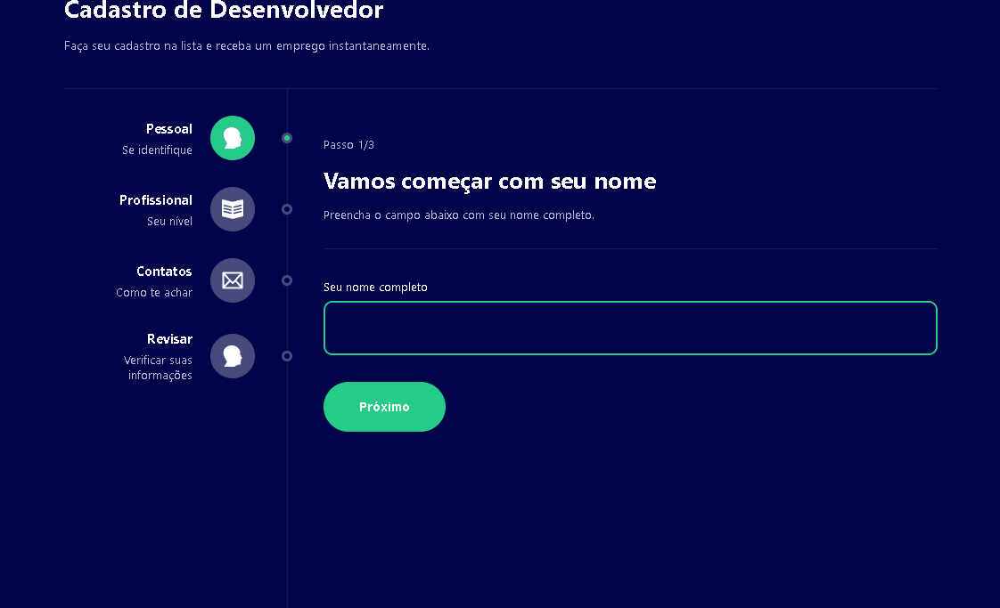

<div align='center'>
  
</div>

## Sobre o projeto 💬

O **MultiForm** é uma aplicação WEB, que faz algumas perguntas para o usuário utilizando Context e Router.

## Funcionalidades 🧠

A aplicação contém as seguintes funcionalidades:

### Index.html 📕

- [x] Armazena informações sobre o usuário em uma varíavel global.

## Pré-requisitos
- [x] Antes de começar, é bom ter instalado em sua maquina a seguinte ferramenta: [GIT](https://git-scm.com/) 
- [x] e também um editor para trabalhar com o codigo como o [VSCode](https://code.visualstudio.com/)

### Rodando o Projeto 📖

```bash
# Clone para este repositório
$ git clone <https://github.com/Pedro-AugusCoelho/MultiForm.git>

# Acesse a pasta do projeto no terminal/cmd
$ cd MultiForm

# Instale as dependências
$ npm/yarn install

# Execute a aplicação em modo de desenvolvimento
$ npm/yarn start

# O servidor iniciará na porta:3000 - acesse <http://localhost:3000>
 
```
## Tecnologias 🛠

Desenvolvido utilizando as seguintes tecnologias:

- [JavaScript](https://www.javascript.com/)
- [ReactJs](https://pt-br.reactjs.org/)
- [Styled-components](https://styled-components.com/)
- [TypeScript](https://www.typescriptlang.org/)
- [React Router](https://v5.reactrouter.com/)

****************

<p align="center">Feito por: Pedro Augusto 🧑🏽🤙🏽</p>

